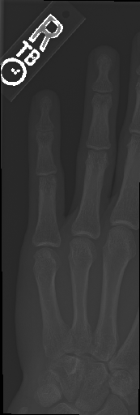
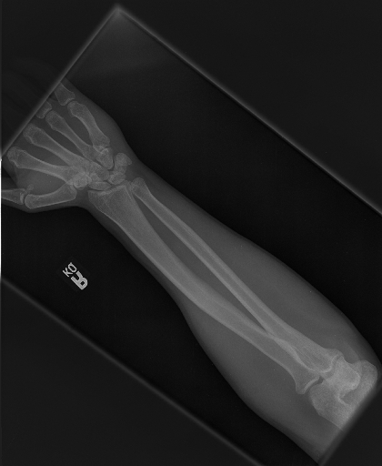
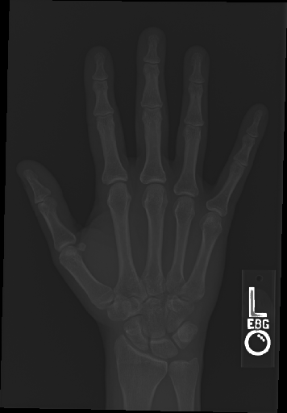
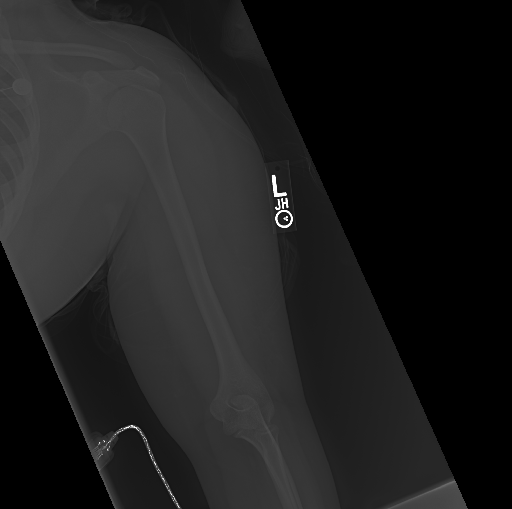
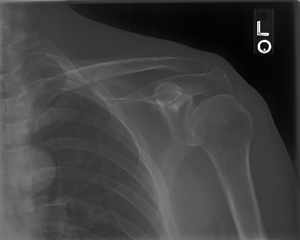
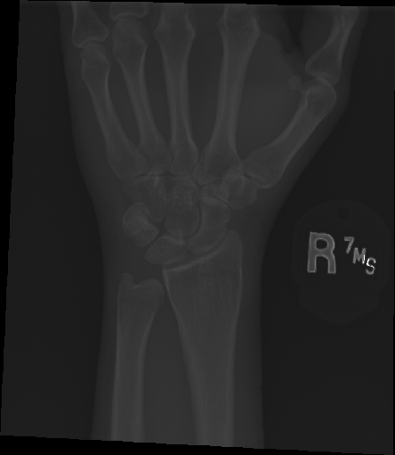
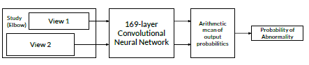

# MURA

The aim of this project is to take in one or more images of X-Ray of different body parts and then classify them to one of the two, normal or abnormal.
The dataset consists of 36,808 images which can be grouped into either of the following: Elbow, Finger, Forearm, Hand, Humerus, Shoulder or Wrist.

Following are the examples of images from each of the group of dataset:

## ELBOW  &nbsp;&nbsp;&nbsp;&nbsp;&nbsp;&nbsp;&nbsp;&nbsp;&nbsp;&nbsp;&nbsp;&nbsp;&nbsp;&nbsp;&nbsp;&nbsp;&nbsp;  FINGER  &nbsp;&nbsp;&nbsp;&nbsp;&nbsp;&nbsp;&nbsp;&nbsp;&nbsp;&nbsp;&nbsp;&nbsp;&nbsp;&nbsp;&nbsp;&nbsp;  FOREARM  &nbsp;&nbsp;&nbsp;&nbsp;&nbsp;&nbsp;&nbsp;&nbsp;&nbsp;&nbsp;&nbsp;&nbsp;&nbsp;  HAND

## HUMERUS  &nbsp;&nbsp;&nbsp;&nbsp;&nbsp;&nbsp;&nbsp;&nbsp;&nbsp;&nbsp;&nbsp;&nbsp;  SHOULDER  &nbsp;&nbsp;&nbsp;&nbsp;&nbsp;&nbsp;&nbsp;&nbsp;&nbsp;&nbsp; WRIST

The model takes in one or more images and run it through the Neural Network and then based on the average of the outcome of images, classify the X-Ray image(s) as normal or abnormal.
The structure of network is as follows:

